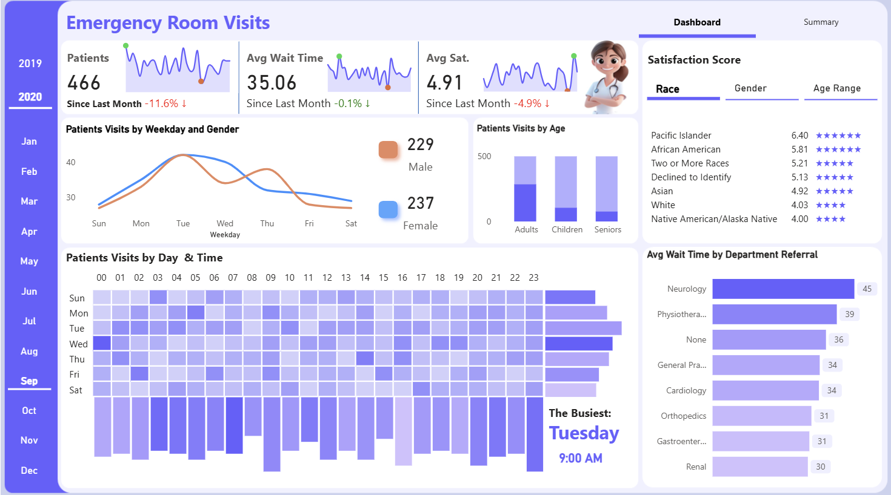

# HealthCare Analytics Dashboard Project

Welcome to the **HealthCare Analytics Dashboard** repository! 🏥📊  
This Power BI project provides actionable insights into hospital operations, enabling informed decisions for resource allocation, patient care optimization, and departmental performance tracking.

---

## 📖 Project Overview

This project focuses on analyzing healthcare data related to **Inpatient**, **Outpatient**, and **Same-Day Admissions**. It enables hospitals to identify trends, understand patient behavior, and improve service delivery across departments.

Key features of the dashboard include:

1. **Interactive Visualizations** for patient admissions, department utilization, and service categories.
2. **Advanced KPIs** such as average length of stay, patient count trends, and occupancy rates.
3. **Segmentation Analysis** based on patient type, department, and admission category.
4. **Operational Reporting Tools** designed for hospital staff and data analysts.
5. **User-Centered Design** for intuitive navigation and actionable storytelling.

🎯 This project demonstrates my capabilities in:
- Healthcare Data Analytics  
- Power BI & Dashboard Design  
- DAX for Advanced Metrics  
- Power Query (ETL)  
- SQL & Data Modeling  
- Data-Driven Decision Support  

---

## 🛠️ Tools & Technologies

- **Power BI Desktop** – Interactive dashboards and data modeling  
- **Microsoft Excel** – Initial cleaning and quick analysis  
- **DAX (Data Analysis Expressions)** – Custom KPIs, calculated fields, and measures  
- **Power Query** – Data shaping, filtering, and transformation  
- **SQL** – Data extraction and backend logic  
- **GitHub** – Version control and documentation

---

## 🧬 Dataset Details

**Source**: Simulated healthcare datasets (CSV format)

- **Categories Tracked**:
  - Admission Type: Inpatient, Outpatient, Same-Day
  - Department: Emergency, Surgery, Cardiology, etc.
  - Patient Metrics: Admission Date, Stay Duration, Visit Count
  - Service Utilization: Beds Occupied, Discharges, Average Stay

- **Data Cleaning**:
  - Removed duplicates and nulls  
  - Standardized formats  
  - Built relationships between tables for star schema modeling

---

## 📈 Key Insights Uncovered

The dashboard helps answer essential hospital questions like:

- What are the most utilized departments and patient types?
- How does **patient volume** vary over time?
- What’s the **average stay duration** per admission type?
- Which **services or departments** are over/under-utilized?
- How can staffing and resources be better aligned with trends?

These insights directly support **hospital administration**, **capacity planning**, and **performance monitoring**.

---

## 📌 Project Objectives

### Business Goal  
Help healthcare providers track key metrics, optimize resource use, and improve service efficiency with a reliable dashboard solution.

### Technical Goal
- Model healthcare data into a clean, performant schema  
- Create advanced measures using DAX  
- Use visual storytelling to turn data into actionable insight  
- Make the dashboard intuitive for both analysts and medical staff

---

## 🔄 Potential Enhancements

- Add real-time or regularly refreshed data integration  
- Expand metrics to include financial or staffing analytics  
- Enable row-level security (RLS) for department-specific reporting  
- Deploy to Power BI Service for hospital-wide access

---

## 🙌 Connect with Me

 Let’s connect!

📧 [princepastakiya@gmail.com]  
🌐 [LinkedIn](https://www.linkedin.com/in/prince-pastakiya/)  
📁 [My Portfolio](https://prince-pastakiya-portfolio.vercel.app/)
